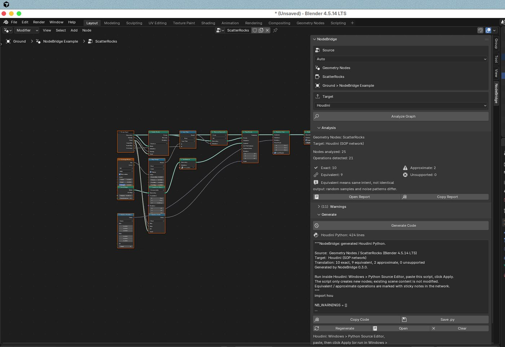
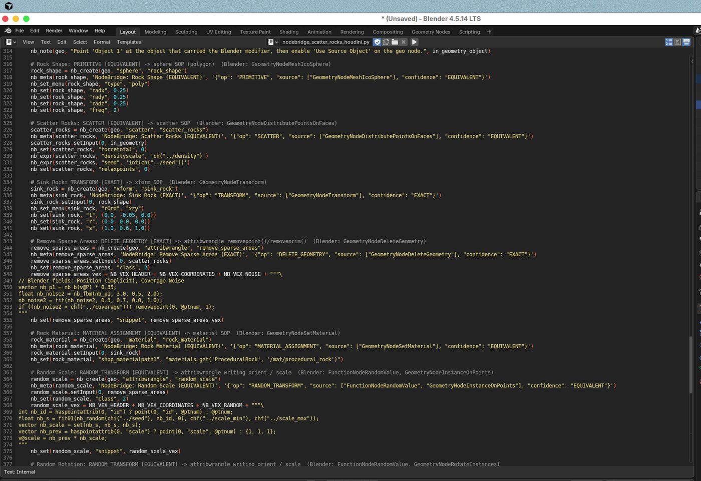
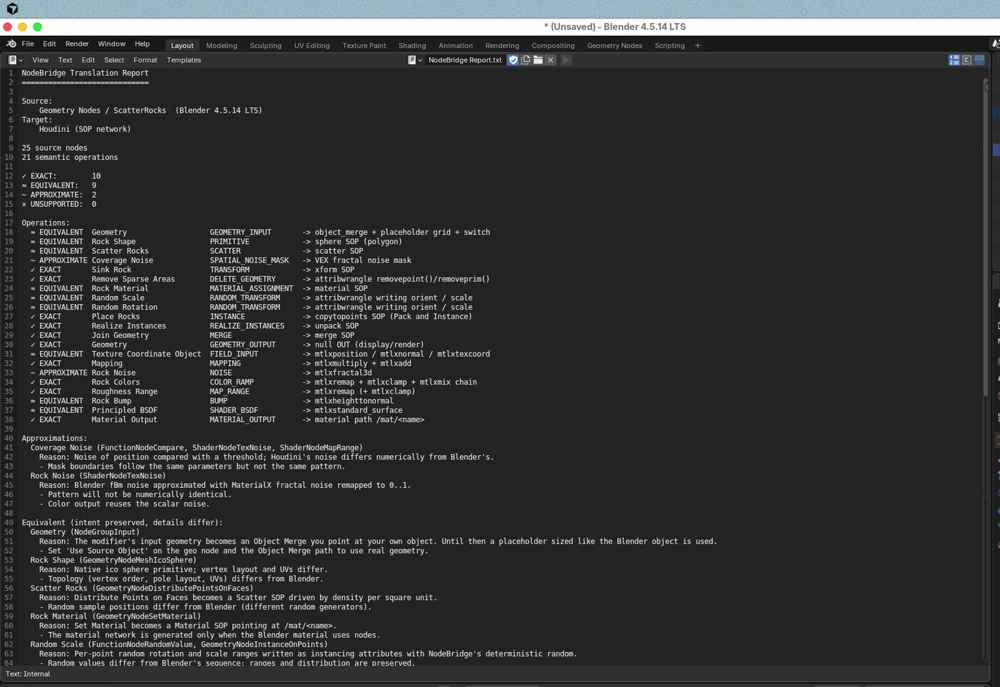
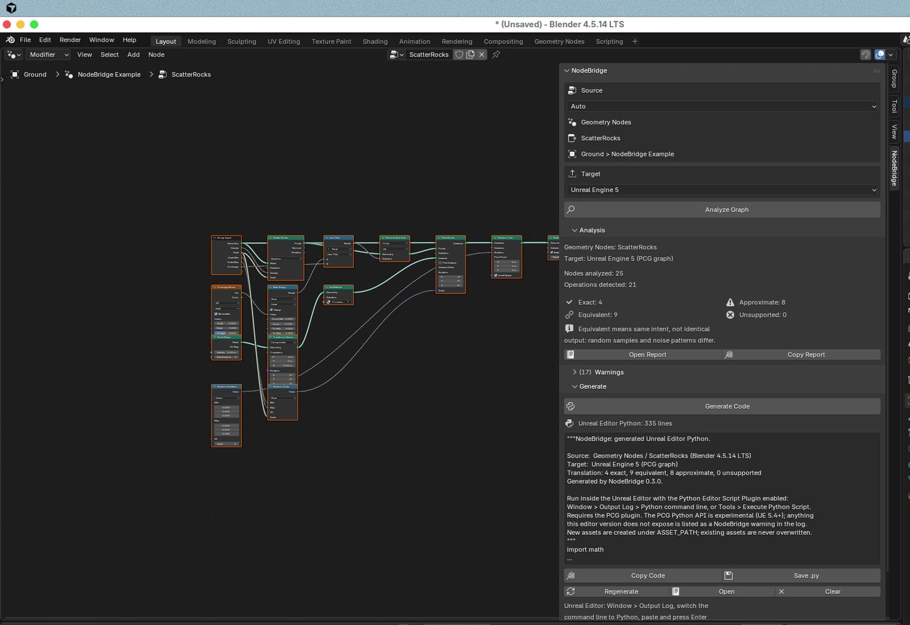
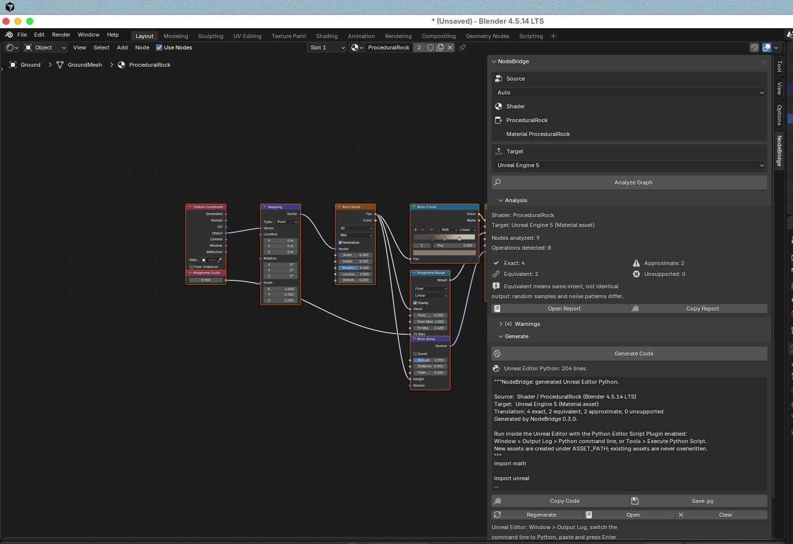
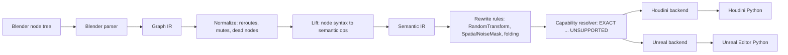

# NodeBridge

**A cross-DCC procedural compiler for Blender.**

Build a procedural system once in Blender. NodeBridge reads the node tree, works out what it *does*, and generates a Python script that rebuilds an equivalent **native, editable** procedural system in **Houdini** or **Unreal Engine 5**. It does not export baked geometry.

> **Do not translate node names. Translate procedural meaning.**
> Source nodes are syntax. NodeBridge's Semantic IR represents meaning. Target backends decide the implementation.



*The NodeBridge sidebar in Blender 4.5 after Analyze and Generate on the bundled scatter example.*

---

## What it does

| You build in Blender | NodeBridge generates | You get |
| --- | --- | --- |
| Geometry Nodes | Houdini Python (`hou`) | A SOP network in a new `/obj` geo node, with your group inputs as live parameters |
| Geometry Nodes | Unreal Editor Python | A PCG graph asset (surface sampler, transform points, mesh spawner, ...) |
| Shader nodes | Houdini Python | A MaterialX network in `/mat` (Karma) |
| Shader nodes | Unreal Editor Python | A Material asset with Scalar / Vector parameters |
| Compositor | Houdini Python | A COP2 network in `/img` |
| Compositor | Unreal Editor Python | An unbound Post Process Volume (bloom, grading, vignette) |

The workflow inside Blender is: **Analyze, Generate, Copy, Paste into the target, Run.**

### Equivalent is not identical

Every translated operation is classified. The report and the panel show the counts, and the generated network carries notes on anything that is not exact.

| Class | Meaning | Example |
| --- | --- | --- |
| **EXACT** | The target reproduces the source behaviour to a very high degree. | Transform Geometry becomes an `xform` SOP with converted axes. |
| **EQUIVALENT** | The procedural intent is preserved; implementation details or samples differ. | Distribute Points on Faces becomes a Scatter SOP: same density, different random positions. |
| **APPROXIMATE** | The target produces a similar result but not the full behaviour. | Blender's Noise Texture becomes Houdini fractal `noise()`: a similar look, but not the same pattern. |
| **UNSUPPORTED** | No reliable translation exists yet. A placeholder and a note are generated. Nothing is dropped silently. | Mesh extrusion in Unreal PCG (PCG works on points, not meshes). |

NodeBridge does **not** promise vertex-identical or pixel-identical results between applications. For most systems you get a *semantically equivalent procedural system* that you can keep editing natively.

---

## Install the Blender add-on

Requirements: **Blender 4.2 LTS or newer** (tested on 4.2 LTS and 4.5 LTS). No other dependencies.

1. Get the add-on zip:
   * download `nodebridge-0.3.0.zip` from the repository's releases, **or**
   * build it from a checkout with `python tools/build_addon.py`, which writes `dist/nodebridge-0.3.0.zip` (Blender is not needed for the build).
2. In Blender, open **Edit > Preferences > Get Extensions**.
3. Click the **⌄** menu in the top-right corner and choose **Install from Disk…**
4. Select `nodebridge-0.3.0.zip`. NodeBridge is installed and enabled.

You can also drag the zip into the Blender window. Blender itself validates the package (`blender --command extension validate dist/nodebridge-0.3.0.zip`).

## Use it: Blender to Houdini

1. Select an object that has a **Geometry Nodes** modifier, and open the **Geometry Node Editor**.
   *To try it without your own scene, open Blender's **Scripting** workspace, open `examples/blender/build_examples.py` in the Text Editor, and click **Run Script**. This builds the four example systems.*
2. Press **N** to open the sidebar, then click the **NodeBridge** tab.
3. **Source** shows what was detected: `Geometry Nodes`, the tree name, and the object and modifier it belongs to. Leave it on **Auto**, or force Geometry Nodes / Shader / Compositor.
4. **Target**: choose **Houdini**.
5. Click **Analyze Graph**. The panel shows the number of nodes analyzed and operations detected, the Exact / Equivalent / Approximate / Unsupported counts, and a warnings list. **Open Report** and **Copy Report** give you the full translation report.
6. Click **Generate Code**. A preview of the generated *Houdini Python* appears.
7. Click **Copy Code**. (**Save .py** writes the script to a file instead; **Open** shows it in Blender's Text Editor.)
8. In Houdini, open **Windows > Python Source Editor**, paste the code, and click **Apply**. You can also paste it into **Windows > Python Shell**.
9. A new geo node such as `/obj/nb_scatter_rocks` appears, containing a native SOP network. Your Blender group inputs (Density, Seed, ...) are on that node's **NodeBridge** parameter tab and drive the SOPs through channel references.
10. If the Blender modifier used the object's own mesh, the network starts from a placeholder grid sized like the Blender object. Point the **Object Merge** at your object, then enable **Use Source Object** on the geo node.

Equivalent and approximate operations are marked with sticky notes in the network. Any SOP parameter that your Houdini version names differently is printed as a `NodeBridge warning:` line instead of stopping the script.

## Use it: Blender to Unreal Engine 5

Steps 1 to 7 are the same, with **Target** set to **Unreal Engine 5**. Then:

1. Enable the **Python Editor Script Plugin**, and for Geometry Nodes also the **PCG** plugin.
2. Click **Save .py** in Blender. In Unreal, choose **Tools > Execute Python Script…** and pick the file. (Pasting into the Output Log's Python console also works where your editor version accepts multi-line input.)
3. A new asset appears under `/Game/NodeBridge`: `PCG_<Name>`, `M_<Name>`, or, for compositor trees, a Post Process Volume in the level. Existing assets are never overwritten.
4. Exposed Blender parameters appear as named **controls** at the top of the script (for example `DENSITY = 4.0`). Edit them and run the script again. Values derived from them stay expressions such as `FLOORS * FLOOR_HEIGHT`.
5. Set `SPAWN_PCG_VOLUME = True` at the top of the script to also place a PCG Volume that uses the new graph.

The PCG Python API is experimental (UE 5.4+). Generated scripts only call documented editor APIs. Anything your editor version does not expose is logged as a `NodeBridge:` warning instead of being faked.

---

## What the generated code looks like

Generated scripts are meant to be read and maintained: one block per operation, the source node named in a comment, readable VEX, and no destructive changes to existing scene content.

```python
# Scatter Rocks: SCATTER [EQUIVALENT] -> scatter SOP  (Blender: GeometryNodeDistributePointsOnFaces)
scatter_rocks = nb_create(geo, "scatter", "scatter_rocks")
scatter_rocks.setInput(0, in_geometry)
nb_set(scatter_rocks, "forcetotal", 0)
nb_expr(scatter_rocks, "densityscale", 'ch("../density")')
nb_expr(scatter_rocks, "seed", 'int(ch("../seed"))')
```

```python
# Random Scale: RANDOM_TRANSFORM [EQUIVALENT] -> PCGTransformPointsSettings
random_scale, random_scale_settings = nb_pcg_node(graph, "PCGTransformPointsSettings", 1200, 0)
nb_edge(graph, remove_sparse_areas_geometry_filter, ['Out'], random_scale, ['In'])
nb_prop(random_scale_settings, "uniform_scale", True)
nb_prop(random_scale_settings, "scale_min", unreal.Vector(SCALE_MIN, SCALE_MIN, SCALE_MIN))
```

| Generated Houdini Python | Translation report |
| --- | --- |
|  |  |
| **Unreal target (PCG)** | **Shader to Unreal Material** |
|  |  |

Complete generated scripts and expected reports for all four examples are in [`examples/`](examples/):

| Example | Blender system | Houdini | Unreal |
| --- | --- | --- | --- |
| [Scatter](examples/scatter/) | ground plane, Distribute Points on Faces, noise coverage mask, random scale and rotation, instanced rocks with a material | 10 exact, 9 equivalent, 2 approximate, 0 unsupported | 4 / 9 / 8 / 0 |
| [Building](examples/building/) | grid footprint, extruded mass, floor slabs stacked from a nested node group, randomized windows on walls | 21 / 3 / 0 / 0 | 4 / 3 / 5 / 11 (PCG has no mesh modelling) |
| [Shader](examples/shader/) | noise, color ramp, roughness modulation, bump, a labeled Value node as a parameter | 4 / 3 / 1 / 0 | 4 / 2 / 2 / 0 |
| [Compositor](examples/compositor/) | render layer, glare, color balance, vignette (ellipse mask + blur + multiply), composite | 0 / 1 / 2 / 2 | 0 / 2 / 3 / 0 |

---

## How it works



* **Graph IR** keeps the source structure: nodes, sockets, links, defaults, interfaces, nested groups and modifier values.
* **Semantic IR** says what the graph does: `SCATTER`, `INSTANCE`, `RANDOM_TRANSFORM`, `NOISE`, `MAP_RANGE`, ... The Blender node types are kept only as provenance.
* **Rewrite rules** recognize multi-node idioms. For example, *Distribute Points → Instance on Points → Rotate Instances with a random value* becomes *Scatter → RandomTransform → Instance*, which maps directly onto Houdini point attributes and onto Unreal's Transform Points ranges.
* **Backends** register translators per operation. Each translator carries its confidence, implementation and limitations, and the [support matrix](docs/support_matrix.md) is generated from that metadata.
* **Fields** have no SOP equivalent, so they are compiled to VEX in Attribute Wrangles. The VEX is evaluated in Blender's Z-up frame, with explicit conversion at the boundary.
* **Centralized conversion layers** handle coordinate systems (handedness, up axis, Euler orders, Unreal rotators, UV origin, normal-map convention), units (meters to Unreal centimeters, radians to degrees, frames) and **deterministic randomness** (`random(seed, id)`, identical in Python and VEX).

Read [docs/architecture.md](docs/architecture.md) for the full design.

---

## Current support

The real current lists are generated from code: [docs/support_matrix.md](docs/support_matrix.md) (every semantic operation against every target).

**Blender nodes lifted to semantic operations**

* **Geometry Nodes:** Group Input/Output, nested node groups, Join Geometry, Transform Geometry, Set Position, Position, Normal, Index, ID, Value / Integer / Boolean / Vector / Color / String inputs, Math, Vector Math, Clamp, Float to Integer, Map Range, Compare, Boolean Math, Switch, Mix, Color Ramp, Combine/Separate XYZ, Noise Texture, Voronoi Texture, Random Value, Distribute Points on Faces, Instance on Points, Realize Instances, Rotate/Scale/Translate Instances, Set Material, Mesh Cube/Grid/UV Sphere/Ico Sphere/Cylinder/Cone/Line/Circle, Curve Line/Circle/Spiral, Curve to Mesh, Resample Curve, Mesh to Curve, Mesh to Points, Extrude Mesh, Subdivide Mesh, Subdivision Surface, Delete Geometry, Separate Geometry, Mesh Boolean, Geometry Proximity, Raycast, Object Info, Collection Info, Named Attribute, Store Named Attribute, Align Euler/Rotation to Vector. Simulation, Repeat and For Each zones are reported as unsupported.
* **Shader:** Material Output, Principled BSDF, Diffuse BSDF, Emission, Mix/Add Shader, Image Texture, Texture Coordinate, UV Map, Geometry, Mapping, Bump, Normal Map, Noise, Voronoi, Gradient/Checker/Wave, Color Ramp, Math, Vector Math, Mix, Map Range, Clamp, Invert, Hue/Saturation, Gamma, Bright/Contrast, RGB to BW, Separate/Combine Color, Value and RGB (labeled ones become parameters).
* **Compositor:** Render Layers, Image, Composite, Viewer, Glare, Color Balance, Ellipse Mask, Blur, Mix, Bright/Contrast, Hue/Saturation, Gamma, Exposure, Lens Distortion, Invert, RGB, Value, Math.

Any other node becomes an `UNSUPPORTED_OPERATION`: it is reported, and a placeholder keeps the target network connected.

---

## What has been verified, and what has not

* **Blender side (verified):** the parser, the add-on UI, the operators and the extension package were run in real **Blender 4.2.23 LTS and 4.5.14 LTS**, both in background and in the GUI. The clipboard copy was checked against the system clipboard. Node socket identifiers and properties were probed in both versions.
* **Generated code (structurally verified):** every generated Houdini and Unreal script is parsed, then executed against recording stand-ins for `hou` and `unreal` (in `tests/fakes/`). Those stand-ins check call shapes, wiring and pin labels.
* **Not yet verified in a live Houdini or Unreal session.** No Houdini or Unreal licence was available while building 0.3. API usage follows the documented `hou` and Unreal Python APIs, and version-sensitive calls are guarded. Some SOP / COP2 parameter names and Unreal PCG property names may differ in your version: the script reports them as warnings instead of failing. Running the four examples in real Houdini 20.x and Unreal 5.4+ is the top item on the [roadmap](docs/roadmap.md).
* **Randomness:** the NodeBridge hash is identical in Python and VEX. The test suite compiles the generated VEX library as C and compares it with Python. Blender's own random sequence is not reproduced, so random-dependent operations are classified EQUIVALENT.

## Known limitations

* PCG works on point data. Mesh modelling operations (extrude, booleans, curves, subdivision) and arbitrary per-point field expressions are UNSUPPORTED on Unreal. Instance geometry becomes an engine basic shape or a named Static Mesh asset.
* Exposed parameters are live Houdini spare parameters. On Unreal they are script-level controls (PCG graph parameters cannot be created reliably from Python yet). Material parameters are real Material parameters.
* Node groups become Houdini subnets with promoted parameters, unless fields cross the group boundary (then they are inlined). On Unreal, groups are inlined.
* Noise and Voronoi patterns differ numerically from Blender's (APPROXIMATE).
* Simulation, Repeat and For Each zones, matrix sockets, menu switches, edge-domain attributes, volume shading and displacement are not translated.
* Houdini compositing targets COP2, not Houdini 20.5's Copernicus. Unreal compositing is limited to Post Process Volume settings.

---

## Command line and development

The compiler is pure Python (3.11+) with no dependencies, and it never imports `bpy` outside the add-on.

```bash
python -m pip install -e ".[dev]"
python -m pytest                                    # 85 tests; Blender tests are skipped
NODEBRIDGE_BLENDER=/path/to/blender python -m pytest tests/test_blender_integration.py

nodebridge analyze  examples/scatter/scatter.graph.json --target houdini
nodebridge generate examples/scatter/scatter.graph.json --target unreal -o scatter_unreal.py
nodebridge capabilities --markdown
```

Graph IR fixtures are exported from Blender with the add-on's **Advanced > Debug Output** option, or with `tests/blender/run_in_blender.py --export-fixtures DIR`. See [CONTRIBUTING.md](CONTRIBUTING.md) for how to add operations, lifters, translators and backends.

NodeBridge works without any AI service. An optional `TranslationFallbackProvider` interface exists for future suggestion tools. Its output only appears as a suggestion in the report and is never executed (default: `None`).

## Documentation

* [Architecture](docs/architecture.md)
* [Support matrix](docs/support_matrix.md) (generated)
* [Roadmap](docs/roadmap.md)
* [Repository audit for the 0.3 rebuild](docs/audit.md)
* [Contributing](CONTRIBUTING.md)

## License

MIT. See [LICENSE](LICENSE).
